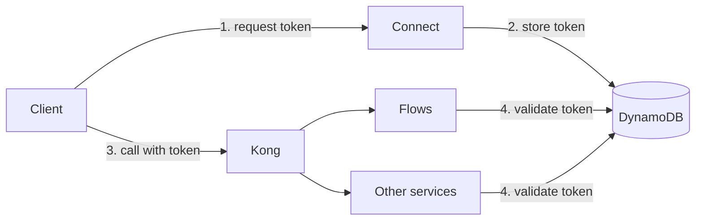

# 01 — Introduction

## The problem

Our platform is made of several independent services, and each of them was born
with its own domain, its own path format, and its own authentication scheme. For
anyone building integrations and automations on top of our API, that meant
finding out where each endpoint lived, getting a different credential for each
service, and treating every response as if it came from a different product.

The cost of that is not technical, it is adoption: the more pieces a client has
to assemble before the first successful call, the more expensive it is to
integrate with us.

## The solution

The API Gateway puts every public endpoint behind **a single address** and **a
single authentication scheme**. The client deals with one contract only:

```http
GET /contacts?limit=10
Authorization: Bearer <session token>
```

The gateway receives that call, decides which service answers it, rewrites the
path to that service's internal format, and forwards the request. The client
does not need to know that `/contacts` is served by Flows at
`/api/v2/contacts.json`, nor that another endpoint comes from a different
service.

Two consequences are worth highlighting:

- **An endpoint that is not exposed is blocked.** The gateway is default-deny:
  only what the code declares explicitly gets through. Publishing an endpoint is
  a deliberate decision, not a side effect of a URL existing.
- **The same token works on any service.** A token issued for a project is
  validated the same way by Flows or by any other integrated service, with no
  service-to-service call on each request.

## The technologies

### Kong

Kong is the gateway itself: it receives the client request, matches the path
against a route, rewrites the URI, and forwards it to the target service.

Every integrated service has, in Kong, a **service** (the destination, holding
the service URL) and a set of **routes**. One of those routes is special: the
block route, which matches everything under the service prefix and answers `403`
with `"Route not authorized by the gateway"`. The allow routes, created from the
service's code, sit in front of it. That combination is what produces the
default-deny behavior.

One operational detail matters: Kong must run in **DB mode** (PostgreSQL). DB
mode is what allows creating and deleting routes through the Admin API at
runtime, which is exactly what our sync does. In DB-less mode the Admin API is
read-only and none of this works.

### DynamoDB

DynamoDB stores the **session tokens** — the tokens clients send in the
`Authorization` header. Each table item is keyed by the token hash and carries
which project it belongs to, which user generated it, and when it expires.

The table is shared across services, and it is what makes the token universal.
Without a shared store, each service would have to call Connect on every request
to know whether a token is valid, putting Connect in the critical path of every
call on the platform. With the table, each service validates the token on its
own: it reads from its local **Redis** and, on a cache miss, fetches from
DynamoDB and warms the cache. DynamoDB also expires items by itself, through
native TTL, so an expired token disappears from the table with nobody having to
clean it up.

## What depends on what

The gateway has **a single mandatory dependency: Connect.** It owns everything
identity-related:

| What | Connect endpoint |
|---|---|
| Issue a session token for a project | `GET /v2/projects/{project_uuid}/get-token` |
| Report the user's role in the project | `GET /v2/projects/{project_uuid}/authorization` |
| Invalidate a session token | `POST /v2/projects/{project_uuid}/invalidate-session-token` |

Without Connect there is no token, and without a token there is no authenticated
call through the gateway. Every other service is **optional**: it joins the
gateway when it wants to expose endpoints, and leaves without affecting the
others.



## What this repository provides

`weni-commons` is what a service installs to join the gateway. It ships two
things:

- **`weni_commons/kong/`** — the `@api_gateway_expose` decorator, which marks in
  code which views are public, and the `kong_ensure_service` and `kong_sync`
  commands, which register that in Kong. Because the route list is derived from
  the code, the gateway follows the service automatically: a new endpoint shows
  up, and an endpoint that lost its decorator is removed.
- **`weni_commons/auth/`** — `SessionTokenAuthentication`, which validates the
  client token against Redis and DynamoDB, and `ConnectProjectAuthorization`, the
  abstract permission class that resolves the user's role through Connect.

## Example in production

**Flows** is the first integrated service and serves as the reference
implementation. It currently exposes two endpoints, declared straight on the
views:

```python
@api_gateway_expose(alias="channels")
class ChannelsEndpoint(ListAPIMixin, BaseAPIView):
    ...


@api_gateway_expose(alias="contacts")
class ContactsEndpoint(ListAPIMixin, WriteAPIMixin, DeleteAPIMixin, BaseAPIView):
    ...
```

For the client, that becomes `GET /contacts` on the gateway address, with the
session token in the header. Nothing in the Flows code changes the original
path: `/api/v2/contacts.json` still exists and is still served normally outside
the gateway.

## Public address

Today the gateway is reached through the **Kong load balancer** address, one per
environment. A friendly public domain in front of the gateway is planned but not
active yet — once it lands, it becomes the recommended address and the load
balancer address turns into an infrastructure detail.

## Next steps

- To understand the full path of a request and Kong's route model:
  [02 — Architecture](02-architecture.md).
- To understand the token, its validation, and the difference between
  authentication and authorization: [03 — Authentication](03-authentication.md).
- To put a service on the gateway: [05 — Installation](05-installation.md).
