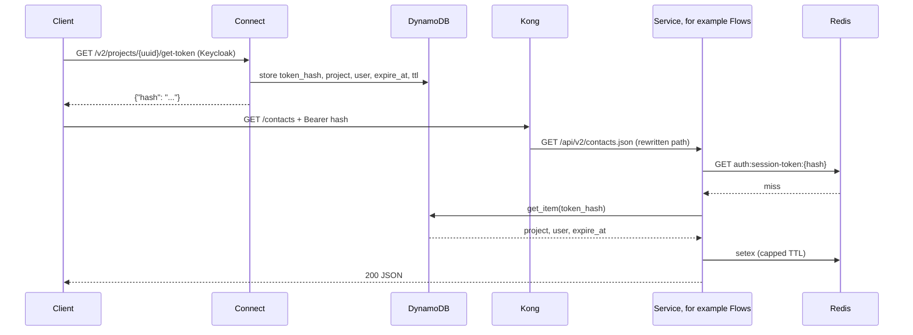
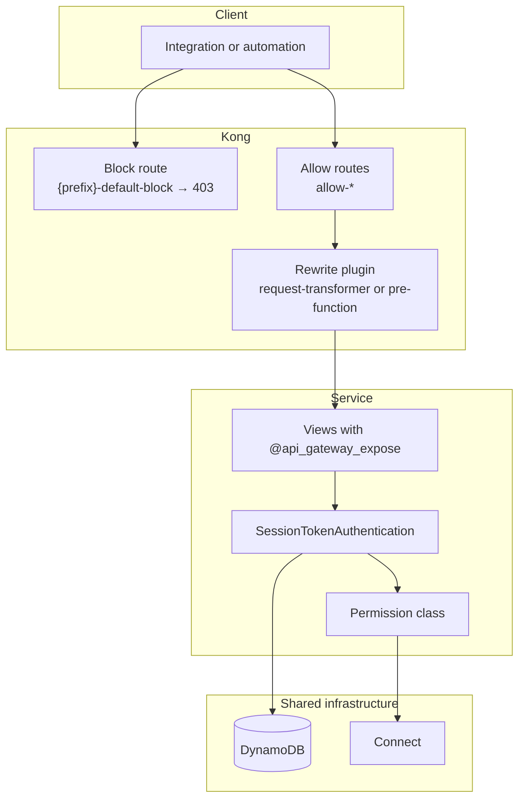

# 02 — Architecture

## The path of a request

From the client's point of view there are two calls: one to get the token and one
to use the API. This is what happens between them:



Two notes about this design:

- Kong **does not validate** the token. It only routes and rewrites the path.
  Validation happens inside the target service, which is the one with access to
  the local Redis and to the DynamoDB table. That keeps the gateway simple and
  prevents a gateway outage from taking authentication down with it.
- Connect only takes part in the first call, the token issuance. After that it
  leaves the path: the service reads the token straight from the shared store.

## Kong

### DB mode

Kong runs in **DB mode**, with PostgreSQL. This is a requirement, not a
preference: in DB-less (declarative) mode the Admin API rejects writes, and our
entire sync works by creating, patching, and deleting routes through it at
runtime.

For the same reason we do not use a declarative `deck sync`: a declarative sync
overwrites Kong's whole state with the contents of a file, which would wipe the
allow routes the services create dynamically.

### One service per service, and the block route

Every integrated service has, in Kong:

- a **service**, pointing to the service's internal URL (`KONG_SERVICE_URL`);
- a **block route**, named `{prefix}-default-block`, matching the service prefix
  and carrying the `request-termination` plugin configured to answer `403` with
  the message `"Route not authorized by the gateway"`;
- a set of **allow routes**, named `allow-*`, one per exposed endpoint.

The block route is created once, by the `kong_ensure_service` command, and is
never touched by the sync. It is what guarantees the default-deny behavior: if a
path does not match any allow route, it falls into the block and the client gets
a `403`, instead of reaching an endpoint nobody meant to publish.

### The allow routes

Each allow route carries:

| Field | Value |
|---|---|
| `name` | `allow-{alias}`, or `allow-{path slug}` when there is no alias |
| `paths` | the public paths that match this route |
| `methods` | the HTTP methods declared on the decorator |
| `strip_path` | always `false` |
| `tags` | `kong-sync` and `prefix-{prefix slug}` |

`strip_path` must stay `false`. Since `paths` holds the full gateway path,
leaving `strip_path=true` would make Kong strip everything that matched and
forward just `/` to the service.

The tags are what lets the sync recognize, later, which routes belong to it. The
prefix tag (`prefix-flows`, for example) is the more important of the two,
because it is service-specific — `kong-sync` is generic and would also show up on
other services' routes. The reasoning is in
[04 — Reference](04-weni-commons-reference.md#prune).

## The path model

An endpoint has two identities: the **internal** path, which is the real Django
path, and the **public** paths, which are what the client calls on the gateway.
The gateway matches the public one and rewrites to the internal one.

Without an alias, the public path is the Django path with the service prefix in
front:

| | Path |
|---|---|
| Public | `/flows/api/v2/contacts.json` |
| Internal | `/api/v2/contacts.json` |

With an alias, three public paths are registered on the same route:

| Public path | Purpose |
|---|---|
| `/contacts` | the short path, the preferred address for the client |
| `/flows/contacts` | compatibility, with the service prefix |
| `/flows/api/v2/contacts.json` | compatibility, the original Django path |

The short path is the whole reason aliases exist: it is what delivers the promise
of a single, simple address, without leaking which service answers it.

Because the short path is global — it has no service prefix at all — two services
declaring the same alias collide, and the last one to sync wins the route
(last-writer-wins, with `service` and upstream repointed). An alias is therefore
a namespace shared by every service on the gateway, and picking an alias already
in use is a silent mistake from Kong's point of view.

## Path rewriting

Since the public and internal paths differ, something has to rewrite the URI
before forwarding. That is done by a plugin on the route, and there are two
modes, chosen automatically based on the path:

**Static path** (no parameters) uses the `request-transformer` plugin, with a
fixed target URI:

```json
{
  "name": "request-transformer",
  "config": { "replace": { "uri": "/api/v2/contacts.json" } }
}
```

**Parameterized path** (detail routes, with `{pk}` and friends) cannot use a
fixed URI, because the parameter value changes on every call. In those cases the
route uses a Kong regex path (`~/flows/dashboards/(?<pk>[^/]+)/widgets`) and the
`pre-function` plugin, with a snippet of Lua that builds the target path at
request time. There are two variations:

- `strip_prefix` — removes the service prefix from the path and keeps the rest,
  including the parameter;
- `alias_captures` — used when the alias itself has parameters
  (`alias="dashboards/{pk}/widgets"`); reads the named URI captures and
  substitutes them into the internal path template.

The sync keeps only the correct plugin on the route: when the mode changes, the
previous mode's plugin is removed, so the route never ends up with two plugins
rewriting the same URI.

## Component overview



## Next steps

- How the token is validated and how authentication and permission are split:
  [03 — Authentication](03-authentication.md).
- How the routes described here are discovered and synced:
  [04 — Reference](04-weni-commons-reference.md).
