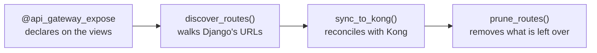

# 04 — weni-commons reference

This file covers what each piece of `weni_commons/kong/` does, in the order they
come into play: declare, discover, sync, delete.



## The decorator

```python
from weni_commons.kong import api_gateway_expose


@api_gateway_expose
class WorkspaceEndpoint(BaseAPIView):
    ...


@api_gateway_expose(methods=["GET", "POST"], alias="events")
class EventsEndpoint(BaseAPIView):
    ...
```

| Parameter | Default | What it does |
|---|---|---|
| `methods` | `["GET"]` | HTTP methods allowed on the route; for ViewSets, methods come from `callback.actions` when present |
| `service` | `None` | Kong service the route is attached to. `None` means the service of this sync, derived from `KONG_URL_PREFIX` (`/flows` → `flows-service`). Pass an explicit name only when the view must attach to a different Kong service |
| `alias` | `None` | short, global public path; accepts parameters, as in `alias="dashboards/{pk}/widgets"` |

The decorator **registers nothing** at import time: it only sets private
attributes on the class or method (`_kong_expose`, `_kong_methods`,
`_kong_service`, `_kong_alias`). Discovery reads those attributes at sync time.

It works in three places: `APIView` classes, whole ViewSets, and individual
`@action` methods. When both the class and the method are decorated, the
**method wins** for `alias` and `service`.

> **Omit `service=` unless you mean a different Kong service.** The default is
> `None`: discovery fills it with the service of this sync. That name comes from
> `KONG_SERVICE` when set, otherwise from the prefix (`/billing` →
> `billing-service`). Pass `service=` only for the rare view that must live on
> another Kong service.

## Discovery

`discover_routes(suffix=".json")` recursively walks Django's URL resolver and
returns the list of routes to register. For each URL pattern it resolves the
internal path preferring `reverse()` — which makes nested includes resolve to the
full path — and falls back to assembling the pattern manually when `reverse()` is
not possible.

Two practical consequences:

- **It only finds what the code imports.** The route list is derived from the
  running process's `ROOT_URLCONF`, so it reflects exactly the image that is
  running. That is what makes the gateway follow the service's deploy, and the
  reason the sync runs with the new image (see
  [06 — Deployment](06-deploy-argo-workflows.md)).
- **`KONG_URL_PREFIX` is required in the environment.** The function reads
  `os.environ["KONG_URL_PREFIX"]` and raises `KeyError` if it is not set.

A duplicate alias is only a warning, not an error. Routes are keyed by name, so
the second declaration overwrites the first and the log records:

```text
WARNING discover_routes: duplicate route name 'allow-contacts' — overwriting
previous registration (was upstream /api/v2/contacts.json)
```

If it shows up, it is worth investigating: it means two endpoints of the service
are competing for the same public path, and one of them will not be exposed.

### Route name

The name is the route's stable identifier in Kong, and it is always prefixed with
`allow-`:

| Case | Name |
|---|---|
| With alias | `allow-{alias}`, with `/` becoming `-` and braces removed |
| Without alias | `allow-{internal path}`, with `/` and `.` becoming `-` |

So `alias="dashboards/{pk}/widgets"` yields `allow-dashboards-pk-widgets`, and the
path `/api/v2/contacts.json` without an alias yields `allow-api-v2-contacts-json`.

## The sync

`sync_to_kong()` **reconciles** the desired state with the actual state instead of
rewriting everything. The flow is:

1. read Kong's state in bulk: every route and every plugin, paginating 1000 at a
   time;
2. for each discovered route, compare with what exists and decide between
   creating, patching, or doing nothing;
3. write the rewrite plugin only when it diverges from the desired one;
4. delete orphan routes, if prune is on.

It returns the tuple `(created, updated, skipped, deleted)` with the route names
in each category, which is what the command prints at the end.

Patching a route includes repointing `service`: that is how alias
last-writer-wins works in practice when another service claims the same alias.

> **Careful when calling it programmatically.** `sync_to_kong()` reads
> `KONG_URL_PREFIX` straight from `os.environ`, not from Django settings. That
> works in the command because `kong_sync` sets the variable in the environment
> before calling. Anyone calling `sync_to_kong()` outside the command must set
> `os.environ["KONG_URL_PREFIX"]` first, otherwise routes are created without the
> prefix tag — and a route without the prefix tag is recognized as ours by path
> alone, which weakens the prune guards.

## Prune

Prune deletes the `allow-*` routes the service exposed before and that discovery
no longer finds — the typical case being an endpoint that lost its decorator. It
is **on by default**, because the goal is for Kong to always converge to what the
code declares.

Deleting a route is a destructive operation on a shared resource, so it is
surrounded by guards.

### The ownership guards

To be a deletion candidate, a route must pass all of these conditions:

| Guard | Why |
|---|---|
| The name starts with `allow-` | protects the block route and any hand-made route |
| The `service.id` matches the service being synced | prevents reaching another service's routes |
| It carries the `prefix-{slug}` tag **or** serves a path under `KONG_URL_PREFIX` | confirms the route belongs to this service |

The third guard uses the **prefix** tag, not the generic `kong-sync` tag. A
route created under another prefix (or an explicit `service=` that pointed here)
already carries `kong-sync`, but its prefix tag is its own. If prune trusted the
generic tag, this sync would treat those routes as its own and delete them. The
prefix tag is specific per URL prefix. The path fallback exists for routes
created before tagging was introduced.

### The volume guard

Even among routes proven to be ours, prune refuses to delete too much at once.
The limit is `max(3, half of the owned routes)`. Above that it raises
`PruneLimitExceeded`, lists the names, and deletes nothing:

```text
prune would delete 7 of 9 managed route(s), above the safety limit of 4:
allow-a, allow-b, ... Re-run with --force-prune to confirm.
```

This protects against the scenario where discovery partially fails — a broken
import, a wrong `KONG_URL_PREFIX` — and the sync would read the incomplete result
as "these endpoints no longer exist".

Along the same lines, prune is aborted without deleting anything when discovery
comes back **empty** or when the service id could not be resolved.

To confirm a large and legitimate deletion, use `--force-prune`.

## Configuration resolution

`resolve_config()`, in `weni_commons/kong/config.py`, is how the commands read
configuration. The precedence is:

```text
command-line flag  →  Django settings  →  environment variable  →  default
```

Empty or whitespace-only values are ignored, and the returned value is stripped.
In practice this means a service can declare everything in `settings.py` and run
the commands with no flags at all, which is the recommended approach.

## The commands

Both are Django management commands, which is why `"weni_commons"` must be in
`INSTALLED_APPS` for them to show up.

### `kong_ensure_service`

Creates the service and the block route. It is idempotent and runs **once, at
onboarding** — it is not part of the deploy cycle. It never touches `allow-*`
routes.

```bash
python manage.py kong_ensure_service
```

| Flag | Equivalent configuration |
|---|---|
| `--kong-addr` | `KONG_ADMIN_URL` (default `http://localhost:8001`) |
| `--service` | `KONG_SERVICE` (optional; derived from `--url-prefix` when omitted) |
| `--url` | `KONG_SERVICE_URL` |
| `--url-prefix` | `KONG_URL_PREFIX` |
| `--dry-run` | shows what would be created, without calling the Admin API |

This command's `--dry-run` is offline: it does not need Kong to be reachable.

### `kong_sync`

Discovers the routes and reconciles them with Kong. This is the command that runs
on every deploy.

```bash
python manage.py kong_sync
python manage.py kong_sync --dry-run
python manage.py kong_sync --no-prune
python manage.py kong_sync --force-prune
```

| Flag | Effect |
|---|---|
| `--kong-addr` | Kong Admin API; `KONG_ADMIN_URL` (default `http://localhost:8001`) |
| `--service` | Kong service; `KONG_SERVICE`, optional — derived from `--url-prefix` when omitted (`/flows` → `flows-service`) |
| `--url-prefix` | service prefix; `KONG_URL_PREFIX` |
| `--suffix` | suffix used when resolving paths (default `.json`) |
| `--dry-run` | computes and prints the plan without writing |
| `--no-prune` | keeps orphan routes |
| `--force-prune` | confirms a prune above the volume guard |

Two things specific to this command:

- **`--service` is optional.** When omitted, it is derived from `KONG_URL_PREFIX`
  (`/flows` → `flows-service`). An explicit `KONG_SERVICE` or `--service` wins.
  The derived name matches the prefix slug used in route tags (`prefix-flows`),
  so prune stays scoped to this service.
- **`--dry-run` needs Kong to be reachable.** The plan is computed against Kong's
  live state, and that is what lets it show deletions too. Without access to the
  Admin API, the dry run does not run.

The output lists one line per affected route and ends with the summary:

```text
Syncing 2 route(s) with http://kong-admin:8001 (service: flows-service, prune: on) ...
  created  allow-contacts     gateway=['/contacts', '/flows/contacts', ...]  upstream=/api/v2/contacts.json  ['GET']  rewrite=static_uri
  deleted  allow-events

Done. 1 created, 0 updated, 1 unchanged, 1 deleted.
```

Admin API errors are reported **with Kong's response body**, not just the status.
That matters because the most common failures are schema violations, whose only
useful clue is in the body.

## Next steps

- Configure everything in a service: [05 — Installation](05-installation.md).
- Automate the sync on deploy: [06 — Deployment](06-deploy-argo-workflows.md).
