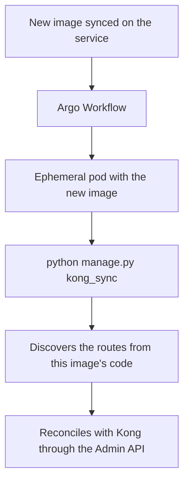

# 06 — Deploying with Argo Workflows

## Why the sync has to run on deploy

The gateway's route list is not hand-written anywhere: it is derived from the code,
by reading the views decorated with `@api_gateway_expose`. That is what keeps the
gateway and the service in agreement, but it creates a temporal dependency — on
every new image, the set of public endpoints may have changed.

Three things can happen between two images:

- a **new** endpoint was decorated, and needs to gain a route in Kong;
- an endpoint **lost** its decorator, and the route must be removed, otherwise it
  stays public with nobody intending it to be;
- an endpoint's **internal path** changed, and the route's rewrite must follow.

None of those changes resolve themselves. If the sync does not run, Kong keeps
serving the previous image's map.

## How it is automated



The trigger is the **sync of a new image on the service**. The workflow spins up an
**ephemeral pod with that image** and runs a single command:

```bash
python manage.py kong_sync
```

`kong_ensure_service` is **not** part of this cycle. It creates the service and the
block route, which are structural and do not change on every deploy, so it is run
manually once, at the service's onboarding.

## Why an ephemeral pod with the new image

This choice is not arbitrary, and understanding why avoids "optimizations" that
break the mechanism.

Route discovery imports `ROOT_URLCONF` and walks the URL resolver of the running
process. In other words: **the result depends on which code is loaded.** A pod with
the new image sees exactly that version's endpoints. A pod with the old image would
see the old map and, worse, prune would read the new endpoints as nonexistent.

Running in an ephemeral pod, instead of inside a pod that is serving traffic, has
two advantages: the sync does not compete for resources with client requests, and a
failure in the command does not affect a process that is serving the API.

For that to work, the ephemeral pod needs the **same environment** as a regular
service pod: the settings and secrets (`KONG_ADMIN_URL`, `KONG_SERVICE`,
`KONG_URL_PREFIX`) and network access to Kong's Admin API. An ephemeral pod without
the right secrets fails with the command's explicit message, which names the
missing value.

## The effect of prune on the pipeline

Prune is on by default, and that has one consequence worth being clear about:
**Kong's state always converges to what the running image declares.**

In practice, an image rollback also reverts the route set. If the new image added
`/invoices` and you roll back to the previous one, the next sync removes the
`/invoices` route, because that image's code no longer declares it. This is the
desired behavior — the gateway should not expose an endpoint the deployed code does
not implement — but it is good to know the reversal is automatic and needs no
manual intervention.

The guards described in
[04 — Reference](04-weni-commons-reference.md#prune) exist precisely for the case
where discovery fails inside the pipeline. If a broken import makes discovery return
very little, prune refuses to delete in bulk and the command fails, instead of
tearing down the service's routes in production.

## Verifying a deploy

After a deploy, to confirm the gateway kept up:

```bash
python manage.py kong_sync --dry-run
```

An up-to-date service shows everything as `skip` and nothing under `create`,
`update`, or `delete`. Anything different means the deploy's sync did not run, or
ran and failed.

## Points to confirm

The details below depend on the infrastructure setup and are not documented here
yet, so that no assumption is recorded as fact:

- which repository holds the workflow manifest, and the `WorkflowTemplate` name;
- the policy when `kong_sync` fails — whether it stops the deploy or only alerts;
- whether there is a single workflow parameterized per service or one per service.

Once that information is confirmed, it lands in this section.
