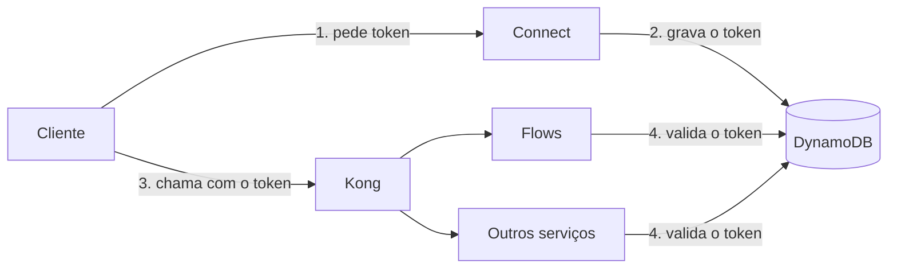

# 01 — Introdução

## O problema

Nossa plataforma é composta por vários serviços independentes, e cada um deles
nasceu com o seu próprio domínio, o seu próprio formato de path e o seu próprio
esquema de autenticação. Para quem construía integrações e automações em cima da
nossa API, isso significava descobrir onde cada endpoint morava, obter um
credencial diferente para cada serviço e tratar cada resposta como se fosse um
produto diferente.

O custo disso não é técnico, é de adoção: quanto mais peças o cliente precisa
montar antes da primeira chamada dar certo, mais caro fica integrar com a gente.

## A solução

O API Gateway coloca todos os endpoints públicos atrás de **um único endereço** e
de **um único esquema de autenticação**. O cliente passa a lidar com um contrato
só:

```http
GET /contacts?limit=10
Authorization: Bearer <session token>
```

Quem recebe essa chamada é o gateway, que decide qual serviço responde, reescreve
o path para o formato interno daquele serviço e encaminha a requisição. O cliente
não precisa saber que `/contacts` é servido pelo Flows em
`/api/v2/contacts.json`, nem que outro endpoint vem de um serviço diferente.

Duas consequências valem ser destacadas:

- **Endpoint não exposto é endpoint bloqueado.** O gateway trabalha em modo
  bloquear por padrão: só passa o que foi declarado explicitamente no código.
  Publicar um endpoint é uma decisão consciente, não um efeito colateral de
  existir uma URL.
- **O mesmo token vale em qualquer serviço.** Um token emitido para um projeto é
  validado igualmente pelo Flows ou por qualquer outro serviço integrado, sem que
  eles precisem conversar entre si a cada requisição.

## As tecnologias

### Kong

O Kong é o gateway propriamente dito: recebe a requisição do cliente, casa o path
com uma rota, reescreve a URI e encaminha para o serviço de destino.

Cada serviço integrado tem, no Kong, um **service** (o destino, com a URL do
serviço) e um conjunto de **rotas**. Uma dessas rotas é especial: a rota de
bloqueio, que casa com tudo dentro do prefixo do serviço e responde `403` com
`"Route not authorized by the gateway"`. As rotas de liberação, criadas a partir
do código do serviço, ficam à frente dela. É essa combinação que produz o
comportamento de bloquear por padrão.

Um detalhe operacional importante: o Kong precisa rodar em **modo com banco**
(PostgreSQL). É o modo com banco que permite criar e apagar rotas pela Admin API
em tempo de execução, que é exatamente o que a nossa sincronização faz. No modo
sem banco a Admin API é somente leitura e nada disso funciona.

### DynamoDB

O DynamoDB guarda os **session tokens** — os tokens que os clientes enviam no
header `Authorization`. Cada item da tabela é indexado pelo hash do token e
carrega a que projeto ele pertence, qual usuário o gerou e quando ele expira.

Essa tabela é compartilhada entre os serviços, e é ela que faz o token ser
universal. Sem um store compartilhado, cada serviço teria que chamar o Connect a
cada requisição para saber se o token é válido, o que colocaria o Connect no
caminho crítico de toda chamada da plataforma. Com a tabela, cada serviço valida
o token por conta própria: lê do seu **Redis** local e, no cache miss, busca no
DynamoDB e aquece o cache. O DynamoDB também expira os itens sozinho, pelo TTL
nativo, então token vencido desaparece da tabela sem ninguém precisar limpar.

## Quem depende de quem

O gateway tem **uma única dependência obrigatória: o Connect.** Ele é o
responsável por toda a parte de identidade:

| O que | Endpoint no Connect |
|---|---|
| Emitir um session token para um projeto | `GET /v2/projects/{project_uuid}/get-token` |
| Informar o papel do usuário no projeto | `GET /v2/projects/{project_uuid}/authorization` |
| Invalidar um session token | `POST /v2/projects/{project_uuid}/invalidate-session-token` |

Sem o Connect não existe token, e sem token não existe chamada autenticada pelo
gateway. Qualquer outro serviço é **opcional**: ele entra no gateway quando quer
expor endpoints, e sai sem afetar os demais.



## O papel deste repositório

O `weni-commons` é o que um serviço instala para entrar no gateway. Ele entrega
duas coisas:

- **`weni_commons/kong/`** — o decorator `@api_gateway_expose`, que marca no
  código quais views são públicas, e os comandos `kong_ensure_service` e
  `kong_sync`, que registram isso no Kong. Como a lista de rotas é derivada do
  código, o gateway acompanha o serviço automaticamente: endpoint novo aparece,
  endpoint que perdeu o decorator é removido.
- **`weni_commons/auth/`** — o `SessionTokenAuthentication`, que valida o token
  do cliente contra Redis e DynamoDB, e o `ConnectProjectAuthorization`, a classe
  de permissão abstrata que consulta o papel do usuário no Connect.

## Exemplo em produção

O **Flows** é o primeiro serviço integrado e serve como referência de
implementação. Ele expõe hoje dois endpoints, declarados diretamente nas views:

```python
@api_gateway_expose(alias="channels")
class ChannelsEndpoint(ListAPIMixin, BaseAPIView):
    ...


@api_gateway_expose(alias="contacts")
class ContactsEndpoint(ListAPIMixin, WriteAPIMixin, DeleteAPIMixin, BaseAPIView):
    ...
```

Do lado do cliente, isso vira `GET /contacts` no endereço do gateway, com o
session token no header. Nada no código do Flows muda o path original: o
`/api/v2/contacts.json` continua existindo e sendo servido normalmente fora do
gateway.

## Endereço público

Hoje o gateway é acessado pelo endereço do **load balancer do Kong**, um por
ambiente. Um domínio público amigável na frente do gateway está previsto, mas
ainda não está ativo — quando entrar, ele passa a ser o endereço recomendado e o
do load balancer vira detalhe de infraestrutura.

## Próximos passos

- Para entender o caminho completo de uma requisição e o modelo de rotas do Kong:
  [02 — Arquitetura](02-arquitetura.md).
- Para entender o token, sua validação e a diferença entre autenticar e
  autorizar: [03 — Autenticação](03-autenticacao.md).
- Para colocar um serviço no gateway: [05 — Instalação](05-instalacao.md).
