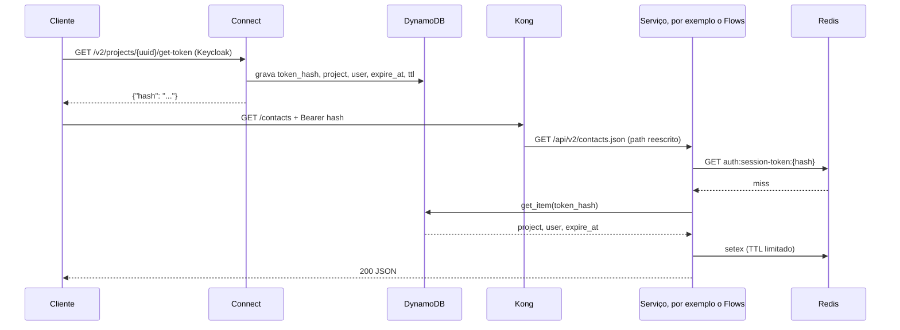
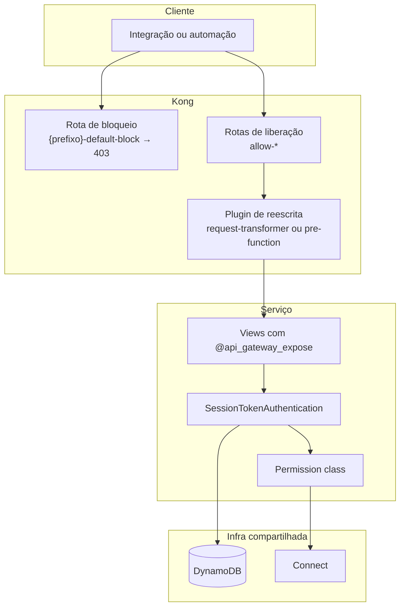

# 02 — Arquitetura

## O caminho de uma requisição

Do ponto de vista do cliente existem duas chamadas: uma para obter o token e
outra para usar a API. O que acontece entre elas é o seguinte:



Duas observações sobre esse desenho:

- O Kong **não valida** o token. Ele só roteia e reescreve o path. A validação
  acontece dentro do serviço de destino, que é quem tem acesso ao Redis local e à
  tabela do DynamoDB. Isso mantém o gateway simples e evita que uma
  indisponibilidade dele derrube a autenticação.
- O Connect só entra na primeira chamada, a de emissão do token. Depois disso ele
  sai do caminho: o serviço lê o token direto do store compartilhado.

## O Kong

### Modo com banco

O Kong roda em **modo com banco**, com PostgreSQL. Isso é um requisito, não uma
preferência: no modo sem banco (declarativo) a Admin API não aceita escrita, e
toda a nossa sincronização é feita criando, alterando e apagando rotas por ela em
tempo de execução.

Pela mesma razão não usamos `deck sync` declarativo: um sync declarativo
sobrescreve o estado inteiro do Kong com o conteúdo de um arquivo, o que apagaria
as rotas de liberação criadas dinamicamente pelos serviços.

### Um service por serviço, e a rota de bloqueio

Cada serviço integrado tem no Kong:

- um **service**, que aponta para a URL interna do serviço (`KONG_SERVICE_URL`);
- uma **rota de bloqueio**, chamada `{prefixo}-default-block`, que casa com o
  prefixo do serviço e tem o plugin `request-termination` configurado para
  responder `403` com a mensagem `"Route not authorized by the gateway"`;
- um conjunto de **rotas de liberação**, chamadas `allow-*`, uma por endpoint
  exposto.

A rota de bloqueio é criada uma vez, pelo comando `kong_ensure_service`, e nunca
é tocada pela sincronização. É ela que garante o comportamento de bloquear por
padrão: se o path não casar com nenhuma rota de liberação, ele cai no bloqueio e
o cliente recebe `403`, em vez de alcançar um endpoint que ninguém pretendia
publicar.

### As rotas de liberação

Cada rota de liberação carrega:

| Campo | Valor |
|---|---|
| `name` | `allow-{alias}`, ou `allow-{slug do path}` quando não há alias |
| `paths` | os paths públicos que casam com essa rota |
| `methods` | os métodos HTTP declarados no decorator |
| `strip_path` | sempre `false` |
| `tags` | `kong-sync` e `prefix-{slug do prefixo}` |

O `strip_path` precisa ficar em `false`. Como o `paths` contém o path completo do
gateway, deixar `strip_path=true` faria o Kong remover tudo que casou e
encaminhar apenas `/` para o serviço.

As tags são o que permite a sincronização reconhecer, mais tarde, quais rotas são
dela. A tag de prefixo (`prefix-flows`, por exemplo) é a mais importante das duas,
porque ela é específica do serviço — a `kong-sync` é genérica e apareceria também
em rotas de outros serviços. O detalhe do porquê está em
[04 — Referência](04-referencia-weni-commons.md#prune).

## O modelo de paths

Um endpoint tem duas identidades: o path **interno**, que é o path real do Django,
e os paths **públicos**, que são o que o cliente chama no gateway. O gateway casa
o público e reescreve para o interno.

Sem alias, o path público é o path do Django com o prefixo do serviço na frente:

| | Path |
|---|---|
| Público | `/flows/api/v2/contacts.json` |
| Interno | `/api/v2/contacts.json` |

Com alias, três paths públicos são registrados na mesma rota:

| Path público | Uso |
|---|---|
| `/contacts` | o path curto, que é o endereço preferencial para o cliente |
| `/flows/contacts` | compatibilidade, com o prefixo do serviço |
| `/flows/api/v2/contacts.json` | compatibilidade, o path original do Django |

O path curto é o motivo de existir o alias: é ele que cumpre a promessa de um
endereço único e simples, sem expor no endereço público qual serviço responde.

Como o path curto é global — não tem prefixo de serviço nenhum —, dois serviços
que declararem o mesmo alias colidem, e o último a sincronizar ganha a rota
(`last-writer-wins`, com o `service` e o upstream sendo reapontados). Alias é,
portanto, um namespace compartilhado entre todos os serviços do gateway, e
escolher um alias já usado é um erro silencioso do ponto de vista do Kong.

## A reescrita do path

Como o path público e o interno são diferentes, alguém precisa reescrever a URI
antes de encaminhar. Isso é feito por um plugin na rota, e existem dois modos,
escolhidos automaticamente conforme o path:

**Path estático** (sem parâmetros) usa o plugin `request-transformer`, com a URI
de destino fixa:

```json
{
  "name": "request-transformer",
  "config": { "replace": { "uri": "/api/v2/contacts.json" } }
}
```

**Path com parâmetros** (rotas de detalhe, com `{pk}` e similares) não pode usar
URI fixa, porque o valor do parâmetro varia a cada chamada. Nesses casos a rota
usa path regex do Kong (`~/flows/dashboards/(?<pk>[^/]+)/widgets`) e o plugin
`pre-function`, com um trecho de Lua que monta o path de destino em tempo de
requisição. Há duas variações:

- `strip_prefix` — remove o prefixo do serviço do path e mantém o resto,
  inclusive o parâmetro;
- `alias_captures` — usado quando o próprio alias tem parâmetros
  (`alias="dashboards/{pk}/widgets"`); lê as capturas nomeadas da URI e as
  substitui no template do path interno.

A sincronização mantém apenas o plugin correto na rota: ao trocar de modo, o
plugin do modo anterior é removido, para a rota não ficar com dois plugins
reescrevendo a mesma URI.

## Panorama dos componentes



## Próximos passos

- Como o token é validado e como autenticação e permissão se dividem:
  [03 — Autenticação](03-autenticacao.md).
- Como as rotas descritas aqui são descobertas e sincronizadas:
  [04 — Referência](04-referencia-weni-commons.md).
