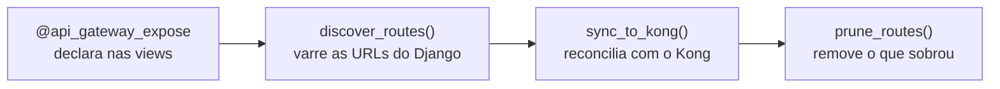

# 04 — Referência do código no weni-commons

Este arquivo cobre o que cada peça do `weni_commons/kong/` faz, na ordem em que
elas entram em ação: declarar, descobrir, sincronizar, remover.



## O decorator

```python
from weni_commons.kong import api_gateway_expose


@api_gateway_expose
class WorkspaceEndpoint(BaseAPIView):
    ...


@api_gateway_expose(methods=["GET", "POST"], alias="events", service="flows-service")
class EventsEndpoint(BaseAPIView):
    ...
```

| Parâmetro | Default | O que faz |
|---|---|---|
| `methods` | `["GET"]` | métodos HTTP liberados na rota; em ViewSets, os métodos vêm de `callback.actions` quando existem |
| `service` | `"flows-service"` | nome do service no Kong ao qual a rota é anexada |
| `alias` | `None` | path público curto, global; aceita parâmetros, como `alias="dashboards/{pk}/widgets"` |

O decorator **não registra nada** no momento do import: ele só marca atributos
privados na classe ou no método (`_kong_expose`, `_kong_methods`, `_kong_service`,
`_kong_alias`). Quem lê esses atributos é a descoberta, em tempo de sync.

Ele funciona em três lugares: classes `APIView`, ViewSets inteiros, e métodos
`@action` individuais. Quando há decorator na classe e no método, o do **método
ganha** para `alias` e `service`.

> **Atenção ao `service`.** O default é `"flows-service"`. Um serviço que não seja
> o Flows e esqueça de passar `service=` vai registrar as suas rotas no service do
> Flows. Isso não é apenas cosmético: o prune age por service, então as rotas
> ficam sujeitas ao sync do Flows. Sempre passe `service=` explicitamente fora do
> Flows.

## A descoberta

`discover_routes(suffix=".json")` percorre recursivamente o resolver de URLs do
Django e retorna a lista de rotas a registrar. Para cada padrão de URL, ela
resolve o path interno preferindo `reverse()` — o que faz includes aninhados
resolverem para o path completo — e cai para a montagem manual do padrão quando
`reverse()` não é possível.

Duas consequências práticas:

- **Ela só encontra o que o código importa.** A lista de rotas é derivada do
  `ROOT_URLCONF` do processo em execução, então ela reflete exatamente a imagem
  que está rodando. É isso que faz o gateway acompanhar o deploy do serviço, e é a
  razão pela qual o sync roda com a imagem nova (ver
  [06 — Deploy](06-deploy-argo-workflows.md)).
- **`KONG_URL_PREFIX` é obrigatório na env.** A função lê
  `os.environ["KONG_URL_PREFIX"]` e levanta `KeyError` se não estiver definido.

Alias duplicado é apenas um aviso, não um erro. As rotas são indexadas pelo nome,
então a segunda declaração sobrescreve a primeira e o log registra:

```text
WARNING discover_routes: duplicate route name 'allow-contacts' — overwriting
previous registration (was upstream /api/v2/contacts.json)
```

Se aparecer, vale investigar: significa que dois endpoints do serviço estão
disputando o mesmo path público, e um deles não será exposto.

### Nome da rota

O nome é o identificador estável da rota no Kong, e é sempre prefixado com
`allow-`:

| Situação | Nome |
|---|---|
| Com alias | `allow-{alias}`, com `/` virando `-` e as chaves removidas |
| Sem alias | `allow-{path interno}`, com `/` e `.` virando `-` |

Assim, `alias="dashboards/{pk}/widgets"` gera `allow-dashboards-pk-widgets`, e o
path `/api/v2/contacts.json` sem alias gera `allow-api-v2-contacts-json`.

## A sincronização

`sync_to_kong()` **reconcilia** o estado desejado com o estado real, em vez de
reescrever tudo. O fluxo é:

1. lê o estado do Kong em massa: todas as rotas e todos os plugins, paginando de
   1000 em 1000;
2. para cada rota descoberta, compara com o que existe e decide entre criar,
   alterar ou não fazer nada;
3. escreve o plugin de reescrita apenas quando ele divergir do desejado;
4. remove as rotas órfãs, se o prune estiver ligado.

Ela retorna a tupla `(created, updated, skipped, deleted)` com os nomes das rotas
em cada categoria, que é o que o comando imprime no final.

A alteração de uma rota inclui reapontar o `service`: é assim que o
last-writer-wins de alias funciona na prática quando outro serviço reivindica o
mesmo alias.

> **Cuidado ao chamar programaticamente.** `sync_to_kong()` lê `KONG_URL_PREFIX`
> direto de `os.environ`, e não pelas settings do Django. Isso funciona no comando
> porque o `kong_sync` define a variável na env antes de chamar. Quem chamar
> `sync_to_kong()` fora do comando precisa definir `os.environ["KONG_URL_PREFIX"]`
> antes, senão as rotas são criadas sem a tag de prefixo — e rota sem tag de
> prefixo é reconhecida como própria só pelo path, o que enfraquece as travas do
> prune.

## Prune

O prune apaga as rotas `allow-*` que o serviço já expôs e que a descoberta não
encontra mais — o caso típico é um endpoint que perdeu o decorator. Ele é **ligado
por padrão**, porque o objetivo é que o Kong sempre convirja para o que o código
declara.

Apagar rota é uma operação destrutiva num recurso compartilhado, então ela é
cercada de travas.

### As travas de propriedade

Para uma rota ser candidata a remoção, ela precisa passar por todas estas
condições:

| Trava | Por quê |
|---|---|
| O nome começa com `allow-` | protege a rota de bloqueio e qualquer rota criada à mão |
| O `service.id` é o do service sendo sincronizado | impede alcançar rotas de outro serviço |
| Tem a tag `prefix-{slug}` **ou** serve um path sob o `KONG_URL_PREFIX` | confirma que a rota é deste serviço |

A terceira trava usa a tag **de prefixo**, e não a tag genérica `kong-sync`, e a
razão é justamente a armadilha do `service` default. Como
`@api_gateway_expose` aponta para `flows-service` por padrão, um repositório que
esqueça o `service=` deposita rotas no service do Flows já com a tag `kong-sync`.
Se o prune confiasse na tag genérica, o sync do Flows consideraria essas rotas
como próprias e as apagaria. A tag de prefixo é específica por serviço e não tem
esse problema. A alternativa pelo path existe para rotas criadas antes de a
marcação por tag existir.

### A trava de volume

Mesmo entre rotas comprovadamente próprias, o prune se recusa a apagar muita
coisa de uma vez. O limite é `max(3, metade das rotas próprias)`. Acima disso ele
levanta `PruneLimitExceeded`, lista os nomes e não apaga nada:

```text
prune would delete 7 of 9 managed route(s), above the safety limit of 4:
allow-a, allow-b, ... Re-run with --force-prune to confirm.
```

Isso protege contra o cenário em que a descoberta falha parcialmente — um import
quebrado, um `KONG_URL_PREFIX` errado — e o sync interpretaria o resultado
incompleto como "esses endpoints não existem mais".

Na mesma linha, o prune é abortado sem apagar nada quando a descoberta vem
**vazia** ou quando o id do service não pôde ser resolvido.

Para confirmar uma remoção grande e legítima, use `--force-prune`.

## A resolução de configuração

`resolve_config()`, em `weni_commons/kong/config.py`, é como os comandos leem a
configuração. A precedência é:

```text
flag da linha de comando  →  settings do Django  →  variável de ambiente  →  default
```

Valores vazios ou só com espaços são ignorados, e o valor retornado vem sem
espaços nas pontas. Na prática isso significa que um serviço pode declarar tudo em
`settings.py` e rodar os comandos sem nenhuma flag, que é a forma recomendada.

## Os comandos

Os dois comandos são management commands do Django, e por isso `"weni_commons"`
precisa estar em `INSTALLED_APPS` para que eles apareçam.

### `kong_ensure_service`

Cria o service e a rota de bloqueio. É idempotente e roda **uma vez, no
onboarding** do serviço — não faz parte do ciclo de deploy. Ele nunca toca nas
rotas `allow-*`.

```bash
python manage.py kong_ensure_service
```

| Flag | Configuração equivalente |
|---|---|
| `--kong-addr` | `KONG_ADMIN_URL` (default `http://localhost:8001`) |
| `--service` | `KONG_SERVICE` |
| `--url` | `KONG_SERVICE_URL` |
| `--url-prefix` | `KONG_URL_PREFIX` |
| `--dry-run` | mostra o que seria criado, sem chamar a Admin API |

O `--dry-run` deste comando é offline: ele não precisa de Kong acessível.

### `kong_sync`

Descobre as rotas e as reconcilia com o Kong. É o comando que roda a cada deploy.

```bash
python manage.py kong_sync
python manage.py kong_sync --dry-run
python manage.py kong_sync --no-prune
python manage.py kong_sync --force-prune
```

| Flag | Efeito |
|---|---|
| `--kong-addr` | Admin API do Kong; `KONG_ADMIN_URL` (default `http://localhost:8001`) |
| `--service` | service no Kong; `KONG_SERVICE`, **sem default** |
| `--url-prefix` | prefixo do serviço; `KONG_URL_PREFIX` |
| `--suffix` | sufixo usado na resolução dos paths (default `.json`) |
| `--dry-run` | calcula e imprime o plano sem escrever |
| `--no-prune` | mantém as rotas órfãs |
| `--force-prune` | confirma um prune acima da trava de volume |

Duas coisas específicas deste comando:

- **`--service` não tem default de propósito.** Como o prune age sobre as rotas
  daquele service, um valor implícito poderia alcançar rotas de outro serviço. Sem
  `KONG_SERVICE` configurado, o comando falha em vez de adivinhar.
- **`--dry-run` precisa de Kong acessível.** O plano é calculado contra o estado
  real do Kong, e é isso que permite ele mostrar também as remoções. Sem acesso à
  Admin API, o dry run não roda.

A saída lista uma linha por rota afetada e termina com o resumo:

```text
Syncing 2 route(s) with http://kong-admin:8001 (service: flows-service, prune: on) ...
  created  allow-contacts     gateway=['/contacts', '/flows/contacts', ...]  upstream=/api/v2/contacts.json  ['GET']  rewrite=static_uri
  deleted  allow-events

Done. 1 created, 0 updated, 1 unchanged, 1 deleted.
```

Erros da Admin API são reportados **com o corpo da resposta do Kong**, não só com
o status. Isso importa porque as falhas mais comuns são violações de schema, cuja
única pista útil está no corpo.

## Próximos passos

- Configurar tudo num serviço: [05 — Instalação](05-instalacao.md).
- Automatizar o sync no deploy: [06 — Deploy](06-deploy-argo-workflows.md).
