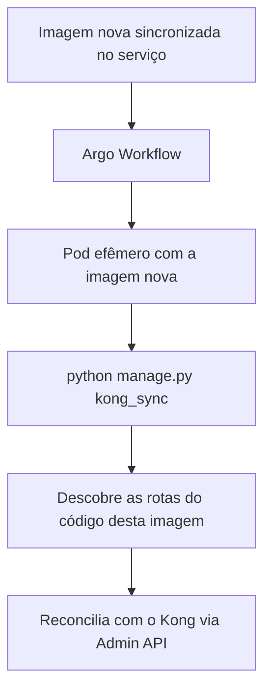

# 06 — Deploy com Argo Workflows

## Por que o sync precisa rodar no deploy

A lista de rotas do gateway não é escrita à mão em nenhum lugar: ela é derivada do
código, lendo as views decoradas com `@api_gateway_expose`. Isso é o que mantém o
gateway e o serviço em acordo, mas cria uma dependência temporal — a cada imagem
nova, o conjunto de endpoints públicos pode ter mudado.

Três coisas podem acontecer entre duas imagens:

- um endpoint **novo** foi decorado, e precisa ganhar rota no Kong;
- um endpoint **perdeu** o decorator, e a rota precisa ser removida, senão ele
  continua público mesmo sem ninguém pretender isso;
- o **path interno** de um endpoint mudou, e a reescrita da rota precisa acompanhar.

Nenhuma dessas mudanças se resolve sozinha. Se o sync não rodar, o Kong continua
servindo o mapa da imagem anterior.

## Como está automatizado



O gatilho é o **sync de uma imagem nova no serviço**. O workflow sobe um **pod
efêmero com essa imagem** e executa um único comando:

```bash
python manage.py kong_sync
```

O `kong_ensure_service` **não** faz parte desse ciclo. Ele cria o service e a rota
de bloqueio, que são estruturais e não mudam a cada deploy, e por isso é executado
manualmente uma única vez, no onboarding do serviço.

## Por que um pod efêmero com a imagem nova

Essa escolha não é arbitrária, e entender o motivo evita "otimizações" que quebram
o mecanismo.

A descoberta de rotas importa o `ROOT_URLCONF` e percorre o resolver de URLs do
processo em execução. Ou seja: **o resultado depende de qual código está carregado.**
Um pod com a imagem nova enxerga exatamente os endpoints daquela versão. Um pod
com a imagem antiga enxergaria o mapa antigo e, pior, o prune interpretaria os
endpoints novos como inexistentes.

Rodar num pod efêmero, em vez de dentro de um pod que está atendendo tráfego,
traz duas vantagens: o sync não compete por recursos com as requisições dos
clientes, e uma falha no comando não afeta um processo que está servindo a API.

Para isso funcionar, o pod efêmero precisa ter o **mesmo ambiente** de um pod
normal do serviço: as settings e as secrets (`KONG_ADMIN_URL`, `KONG_SERVICE`,
`KONG_URL_PREFIX`) e rota de rede até a Admin API do Kong. Um pod efêmero sem as
secrets certas falha com a mensagem explícita do comando, que aponta qual valor
está faltando.

## O efeito do prune no pipeline

O prune é ligado por padrão, e isso tem uma consequência que vale ter clara: **o
estado do Kong sempre converge para o que a imagem em execução declara.**

Na prática, um rollback de imagem também reverte o conjunto de rotas. Se a imagem
nova adicionou `/invoices` e você faz rollback para a anterior, o próximo sync
remove a rota de `/invoices`, porque o código daquela imagem não a declara mais.
Isso é o comportamento desejado — o gateway não deve expor um endpoint que o
código no ar não implementa — mas é bom saber que a reversão é automática e não
precisa de intervenção manual.

As travas descritas em [04 — Referência](04-referencia-weni-commons.md#prune)
existem justamente para o caso em que a descoberta falha no pipeline. Se um import
quebrado fizer a descoberta retornar pouca coisa, o prune se recusa a apagar em
massa e o comando falha, em vez de derrubar as rotas do serviço em produção.

## Verificando um deploy

Depois de um deploy, para confirmar que o gateway acompanhou:

```bash
python manage.py kong_sync --dry-run
```

Um serviço em dia mostra tudo como `skip` e nada em `create`, `update` ou
`delete`. Qualquer coisa diferente disso significa que o sync do deploy não rodou,
ou rodou e falhou.

## Pontos a confirmar

Os detalhes abaixo dependem da configuração de infraestrutura e ainda não estão
documentados aqui, para não registrar suposição como fato:

- em qual repositório vive o manifest do workflow, e o nome do `WorkflowTemplate`;
- a política em caso de falha do `kong_sync` — se ela interrompe o deploy ou apenas
  alerta;
- se existe um workflow único parametrizado por serviço ou um por serviço.

Quando essas informações forem confirmadas, elas entram nesta seção.
